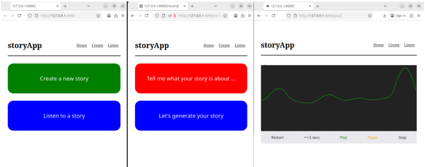

# Introduction

This application was developed as the final project for the BSc in Computer Science of the University of London (Goldsmiths). 

The project is based on the template “4.1 Orchestrating AI models to achieve a goal” and its aim is to build a system that generates and reads stories for children, based on user prompts. 

# System requirements

- Processor: multi-core processor (Intel Core i3 or equivalent)
- RAM: 32 GB
- Storage: 20-30 GB free disk space
- Operating system: Linux (Ubuntu 24.04+)

# Software requirements

- python 3.12.3
- ollama (framework and python wrapper)
- transformers 
- smolagents and 'smolagents[litellm]'
- torch 
- torchaudio 
- torchcodec
- ffmpeg (framework and python wrapper: ffmpeg-python)
- django 
- p5.js
- p5.sound.js

# Installation 

## General

- Codebase: from the terminal, run the command `git clone https://github.com/rgottberg/uol_fp.git`
- ffmpeg: from the terminal, run the command `sudo apt install ffmpeg`
- p5.js (v1.11.11 2025-10-20) and p5.sound.js (v1.0.1 - 2021-05-25): download the complete library from https://p5js.org/download/ and save the "files p5.js" and "p5.sound.js" in the folder "djangoProject/storyApp/static/storyApp/p5_library"

## Python requirements (terminal)

- Start from the project root folder "uol_fp"
- Create a virtual environment with the command `python3 -m venv venv`
- Activate the virtual environment with the command `source venv/bin/activate`
- Install the requirements with the command `pip install -r requirements.txt`

## AI models (terminal)

- Start from the project root folder "uol_fp"
- Move to the Django folder with the command `cd djangoProject`
- HuggingFace models (ASR & TTS): run the command `python3 download_hf_models.py` and ensure the models are saved in the folders "djangoProject/hf_models/mms-tts-eng/" and "djangoProject/hf_models/whisper-medium"
- Ollama framework: run the command `curl -fsSL https://ollama.com/install.sh | sh`
- Ollama models (LLM & agent brain): run the commands `ollama run granite3.1-moe:1b` and `ollama run qwen2.5-coder:3b`
 
# Run the app (terminal)

- Start from the project root folder "uol_fp"
- Activate the virtual environment with the command `source venv/bin/activate`
- [Optional] To run the app without the internet connection, cache a "tokenizer" file locally with the command `python -c "import tiktoken; tiktoken.get_encoding('cl100k_base')"` 
- Move to the Django folder with the command `cd djangoProject`
- Start the server with the command `python3 manage.py runserver`

The app should be running on http://127.0.0.1:8000/

# Creating your story

- Start from either the "Home" page, by clicking on the button "Create a new story", or the "Create" page.
- Record your audio prompt by clicking on the button "Tell me what your story is about..."
- End your recording by clicking on the button "Stop your recording".
- [Optional] Verify your audio by clicking on the button "Play your recording".
- Start the creation process by clicking on the button "Let's generate your story". 
- Click on the button "Listen to a story" to redirect you to the audio player.

# Listening your story

- Start from the "Listen" page.
- Use the playback controls and enjoy your story.
